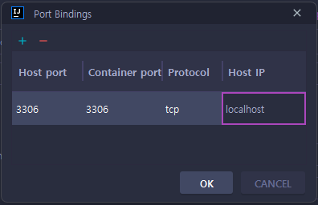
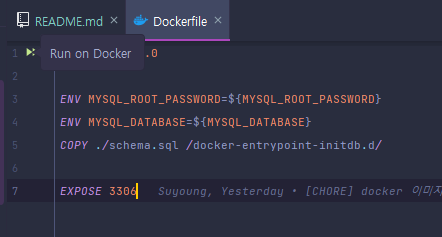
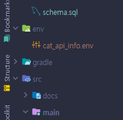

# jwp_cat_picture_search

## 초기설정

### 1. Dokerfile을 오른쪽 마우스 버튼을 클릭하면 Run Configuration을 수정할 수 있습니다.


### 2. Run 파트의 Modify를 눌러서 Bind ports를 누르고 아래와 같이 설정해줍니다.



### 3. Container name을 설정해주고 apply 후에 Dockerfile의 실행버튼을 누릅니다.



### 4. env를 설정해줍니다. src와 같은 레벨에 env 디렉토리를 만들고 그 내부에 cat_api_info.env 파일을 넣어줍니다.



```aidl
CAT_API_HOST=https://api.thecatapi.com/v1
CAT_API_KEY=자신의 API key 넣기
```

### 5. 애플리케이션을 실행해줍니다.